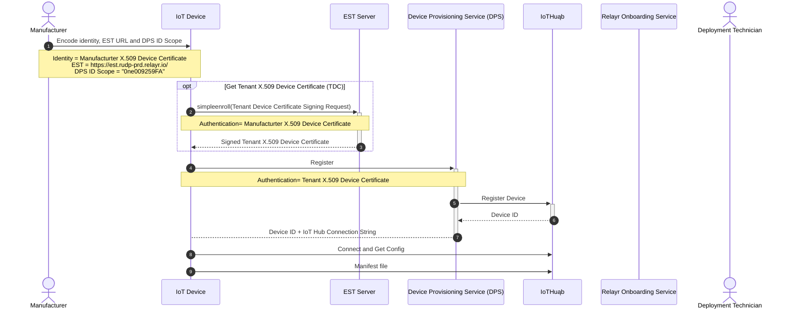

```mermaid
sequenceDiagram
    autonumber
    actor MF as Manufacturer 
    participant EA as IoT Device
    participant EST as EST Server
    participant DPS as Device Provisioning Service (DPS)
    participant IH as IoTHuąb
    participant RDO as Relayr Onboarding Service
       actor GDT as Deployment Technician 
    link EA: Github @ https://github.com/relayr/gwa-azure-edge-agent
    MF->>EA: Encode identity, EST URL and DPS ID Scope
    Note over MF, EA: Identity = Manufacturter X.509 Device Certificate<br/>EST = https://est.rudp-prd.relayr.io/<br/>DPS ID Scope = "0ne009259FA"
    opt Get Tenant X.509 Device Certificate (TDC)
    EA->>+EST: simpleenroll(Tenant Device Certificate Signing Request)
    Note over EA, EST: Authentication= Manufacturter X.509 Device Certificate 
    EST-->>-EA: Signed Tenant X.509 Device Certificate 
    end
    EA->>+DPS: Register
    Note over EA, DPS: Authentication= Tenant X.509 Device Certificate 
    DPS->>+IH: Register Device
    IH-->>-DPS: Device ID
    DPS-->-EA: Device ID + IoT Hub Connection String
    EA->>IH: Connect and Get Config
    EA->>IH: Manifest file
```
